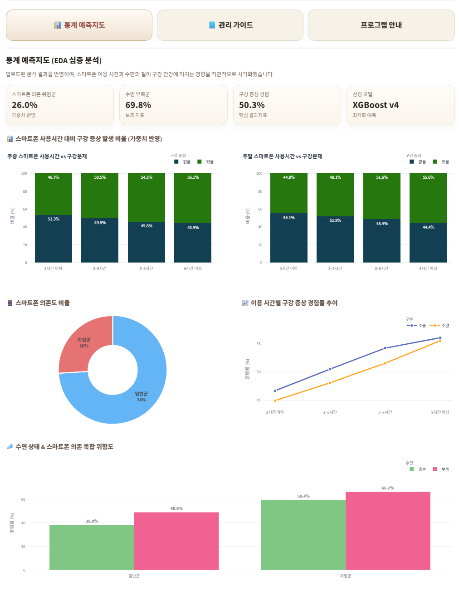
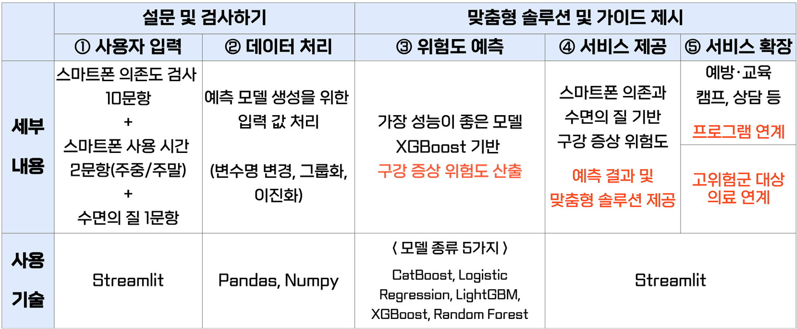
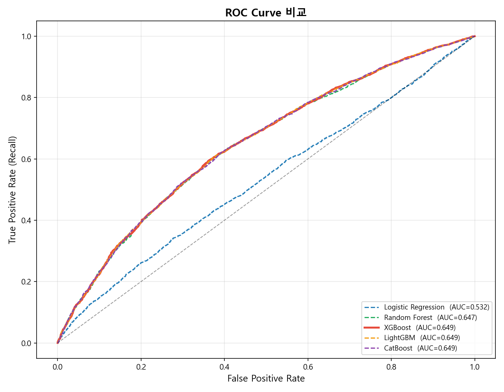
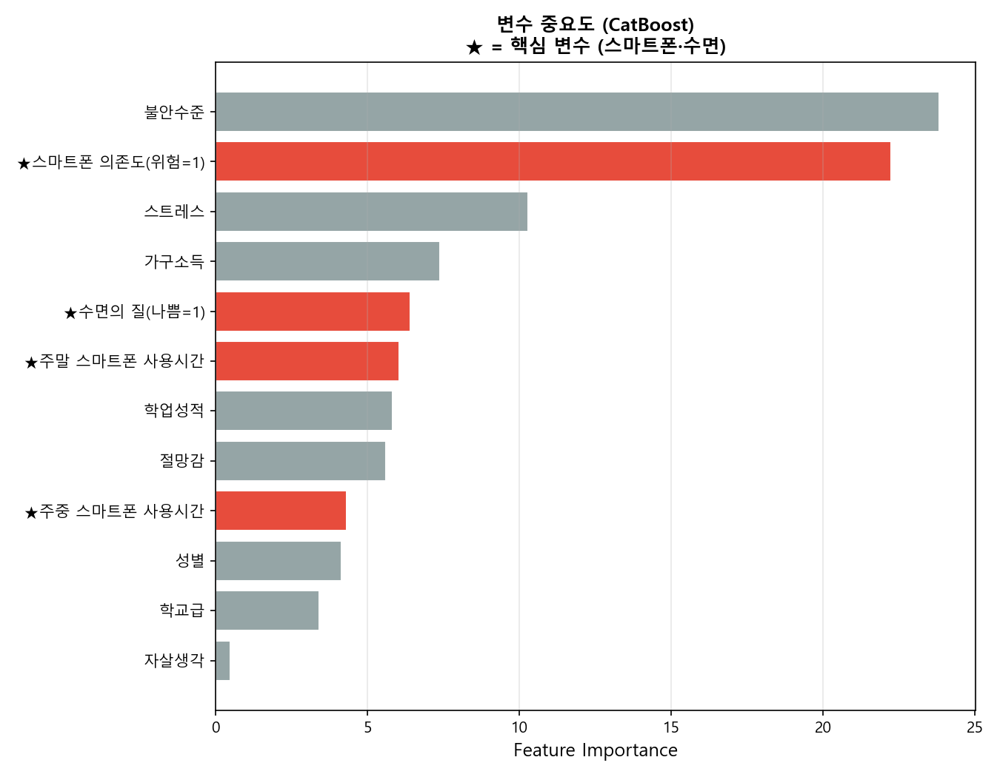
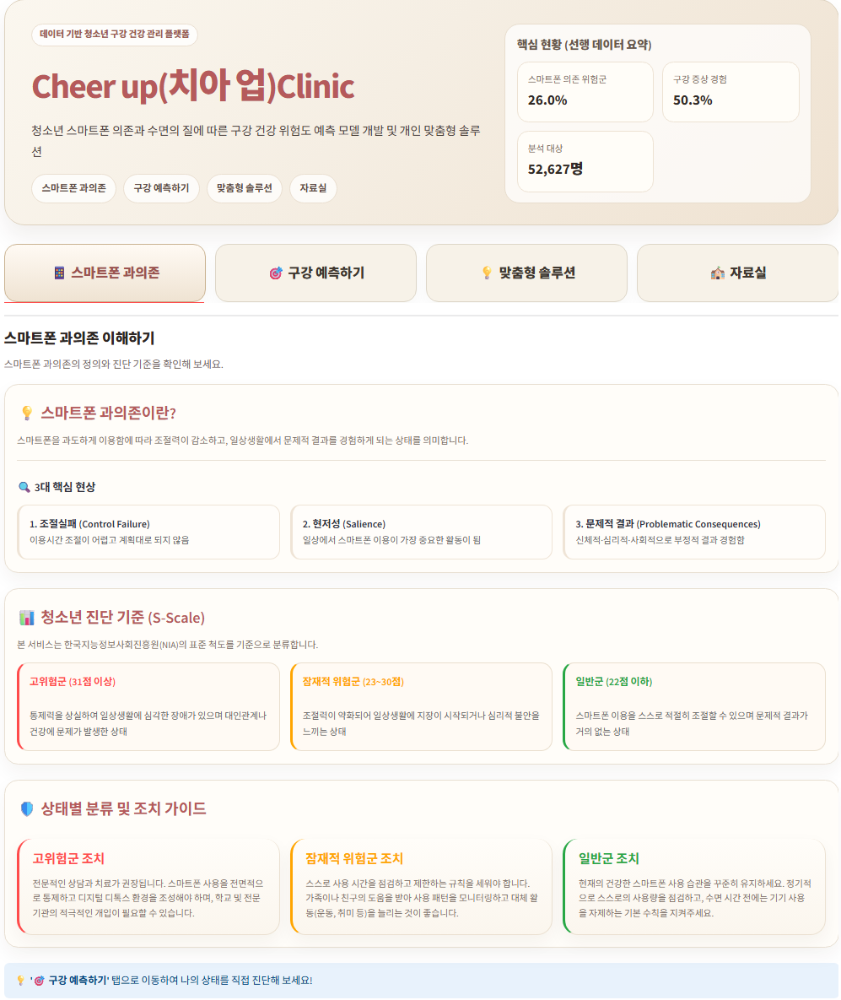
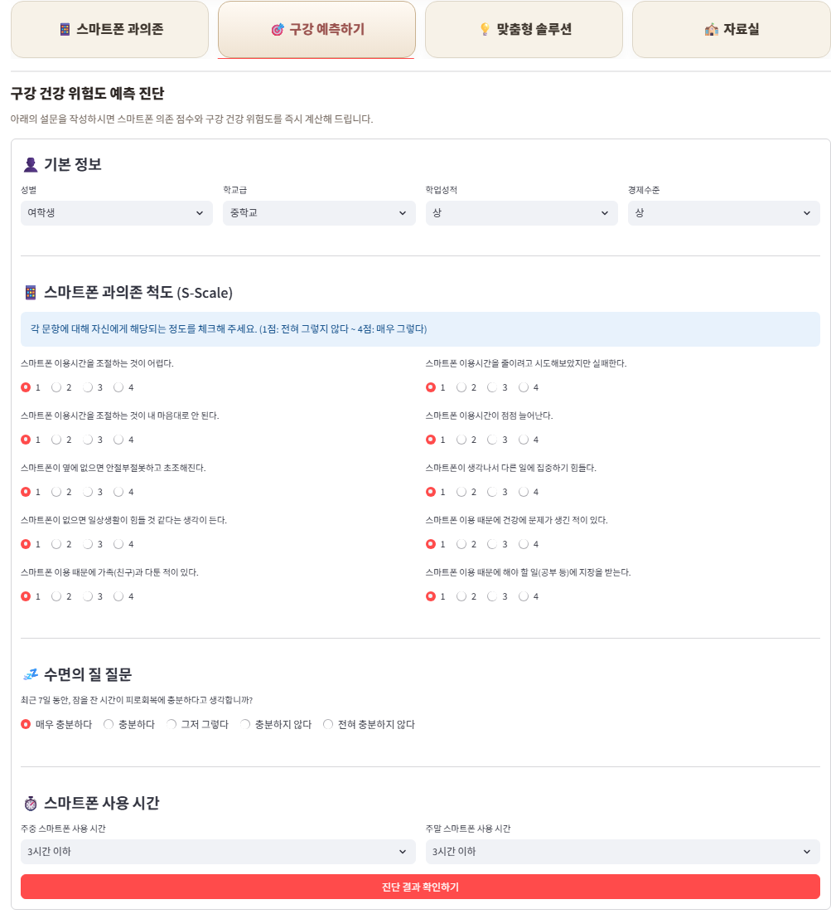
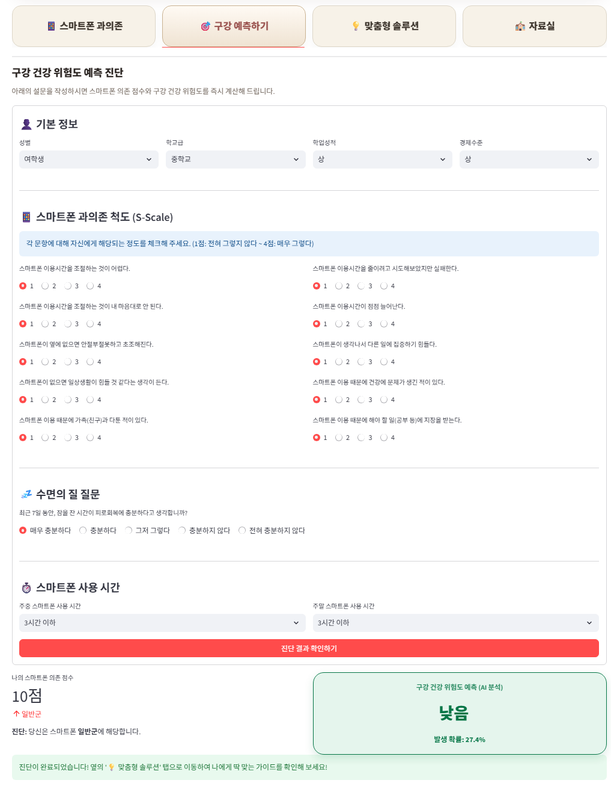
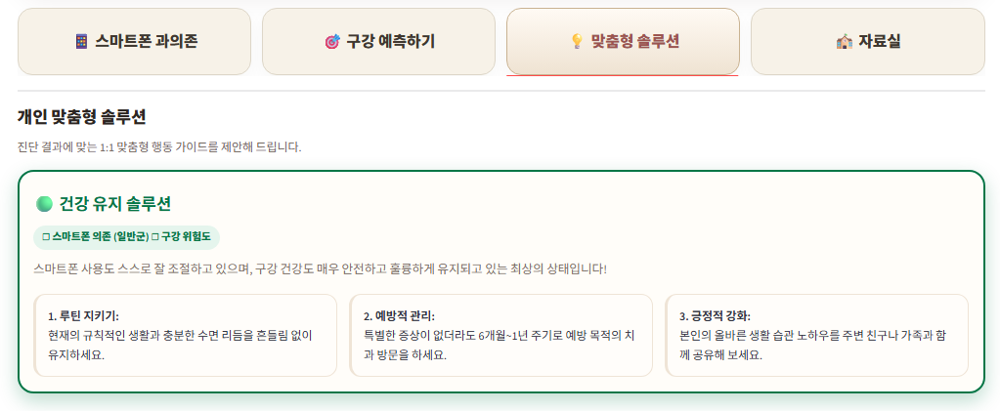

# 🦷 Cheer up(치아 업) Clinic  
### ML기반 청소년 스마트폰 의존과 수면의 질에 따른 구강 증상 위험도 예측 모델 개발 및 맞춤형 관리 서비스

> 질병관리청 제16차(2020년) 청소년건강행태조사(KYRBS) 데이터를 기반으로  
> 스마트폰 과의존, 수면 상태, 정신건강, 생활습관 변수를 분석하여 청소년의 구강 증상 위험도를 예측하고 개인 맞춤형 관리 솔루션을 제공하는 ML 기반 웹 서비스입니다.

<br/>

## 🔗 Project Links

| 구분 | 링크 |
|---|---|
| 발표자료 | [발표자료 보기](https://docs.google.com/presentation/d/1WzqmbG6LJnliDJYnZMHXpBtiygpEmZB6/edit?usp=sharing&ouid=116000083308723048290&rtpof=true&sd=true) |
| GitHub Repository | [Oral_Health_Prediction](https://github.com/0jae0517/Oral_Health_Prediction) |
| Streamlit Demo | [시연 영상 보기](https://drive.google.com/file/d/1j-8EbZOCZkepf_FD33XVYiCSTOmO44Tz/view?usp=sharing) |

<br/>

## 🛠 Tech Stack


<br/>

---

# 1. 기획

## 1-1. Project Overview

본 프로젝트는 청소년의 구강 건강 문제를 조기에 파악하기 위해  
**스마트폰 과의존, 수면의 질, 정신건강, 생활습관 요인**을 활용하여  
구강 건강 위험도를 예측하는 AI 기반 헬스케어 서비스입니다.

단순히 예측 결과만 제공하는 것이 아니라, 사용자의 스마트폰 의존 수준과 구강 건강 위험도를 함께 고려하여  
**개인 맞춤형 행동 가이드**를 제공하는 것을 목표로 합니다.

<br/>

### 핵심 기능

- 청소년 구강 건강 위험도 예측
- 스마트폰 과의존 척도 기반 위험군 분류
- 수면 상태 및 스마트폰 사용 시간 반영
- 머신러닝 기반 구강 증상 발생 가능성 예측
- 예측 결과에 따른 개인 맞춤형 솔루션 제공
- EDA 기반 통계 예측지도 시각화

<br/>

---

## 1-2. Background & Problem

청소년의 스마트폰 사용 시간이 증가하면서 수면 부족, 정신건강 문제, 생활습관 불균형이 함께 나타나고 있습니다.  
이러한 요인들은 구강 건강 관리 습관에도 영향을 줄 수 있으며, 구강 증상 발생 가능성과도 관련될 수 있습니다.

기존의 구강 건강 관리는 증상 발생 이후 병원에 방문하는 사후 관리 중심인 경우가 많습니다.  
따라서 본 프로젝트에서는 데이터 기반 예측 모델을 통해 구강 건강 위험을 조기에 파악하고,  
예방적 관리 행동을 유도하는 서비스를 기획했습니다.

<br/>

### 문제 정의

| 문제점 | 설명 |
|---|---|
| 청소년 스마트폰 과의존 증가 | 스마트폰 사용 시간이 길어지며 수면, 생활습관, 건강 관리에 부정적 영향 가능 |
| 구강 건강 관리 부족 | 증상이 발생한 이후 병원을 찾는 사후 관리 중심 |
| 개인별 위험도 파악 어려움 | 생활습관과 심리 요인을 종합적으로 고려한 예측 서비스 부족 |
| 예방 중심 솔루션 부족 | 위험도에 따른 맞춤형 행동 가이드 제공이 제한적 |

<br/>

---

## 1-3. Service Goal

본 프로젝트의 목표는 단순한 예측 모델 개발에 그치지 않고,  
분석 결과를 실제 사용자가 활용할 수 있는 웹 서비스 형태로 구현하는 것입니다.

<br/>

| 목표 | 설명 |
|---|---|
| 위험도 예측 | 청소년의 생활습관 및 건강행태 데이터를 기반으로 구강 건강 위험도 예측 |
| 위험군 선별 | 스마트폰 과의존, 수면, 정신건강 요인을 반영한 위험군 판단 |
| 맞춤형 솔루션 | 예측 결과에 따라 개인별 관리 가이드 제공 |
| 시각화 제공 | EDA 기반 통계 예측지도와 주요 분석 결과 시각화 |
| 서비스 구현 | Streamlit 기반 사용자 입력형 예측 서비스 구현 |

<br/>

---

# 2. 개발

## 2-1. Dataset

본 프로젝트에서는 **질병관리청 제16차(2020년) 청소년건강행태조사 원시자료**를 활용했습니다.

청소년건강행태조사는 대한민국 청소년의 건강행태 현황을 파악하기 위해 수행되는 국가 단위 조사이며,  
본 프로젝트에서는 이 중 스마트폰 사용, 수면, 정신건강, 구강건강 관련 변수를 활용하여  
청소년 구강 건강 위험도 예측 모델을 개발했습니다.

<br/>

### 사용 데이터셋

| 구분 | 내용 |
|---|---|
| 데이터셋명 | 제16차(2020년) 청소년건강행태조사 원시자료 |
| 영문명 | Korea Youth Risk Behavior Survey, KYRBS |
| 제공기관 | 질병관리청 |
| 조사연도 | 2020년 |
| 사용 파일 | `kyrbs2020.sas7bdat` |
| 원자료 크기 | 54,948명 × 170개 컬럼 |
| 최종 분석 데이터 | 52,627명 × 14개 컬럼 |
| 제공 형식 | SAS 원시자료 |
| 활용 목적 | 스마트폰 과의존, 수면, 정신건강, 구강건강 관련 변수 기반 구강 건강 위험도 예측 |

<br/>

### 주요 활용 변수

| 구분 | 활용 변수 예시 | 원자료 변수 |
|---|---|---|
| 인구통계 정보 | 성별, 학교급, 학업성적, 경제수준 | `SEX`, `GRADE`, `E_S_RCRD`, `E_SES` |
| 스마트폰 사용 정보 | 주중/주말 스마트폰 사용 시간 | `INT_SPWD_TM`, `INT_SPWK_TM` |
| 스마트폰 과의존 정보 | 스마트폰 과의존 진단 문항 | `INT_SP_OU_1` ~ `INT_SP_OU_10` |
| 수면 관련 정보 | 수면 충족도 | `M_SLP_EN` |
| 정신건강 정보 | 불안, 스트레스, 우울감, 자살 생각 | `M_GAD_1` ~ `M_GAD_7`, `M_STR`, `M_SAD`, `M_SUI_CON` |
| 구강 건강 정보 | 치아 깨짐, 씹기 불편, 치아 통증, 잇몸 출혈 | `O_SYMP1` ~ `O_SYMP4` |
| 표본 가중치 | 복합표본설계 가중치 | `W` |

<br/>

---

## 2-2. Data Preprocessing & Feature Engineering

건강 및 의료 행동 데이터에서는 변수를 어떻게 정의하고 조합하는지에 따라 모델 결과가 크게 달라질 수 있습니다.  
따라서 본 프로젝트에서는 단순히 원자료 변수를 그대로 사용하지 않고,  
청소년의 스마트폰 사용 패턴, 수면 상태, 정신건강 상태, 구강 증상 경험을 모델 학습에 적합한 형태로 재구성했습니다.

<br/>

### 전처리 과정

```text
SAS 원시자료 로드
        ↓
분석에 필요한 원시 변수 선택
        ↓
스마트폰 사용 시간 범주화
        ↓
스마트폰 과의존 점수 생성
        ↓
불안 점수 및 정신건강 변수 생성
        ↓
구강 증상 경험 여부 타깃 생성
        ↓
수면 상태 변수 생성
        ↓
결측치 제거
        ↓
최종 분석 데이터 저장
```

<br/>

### Feature Engineering 상세

| 파생 변수 | 생성 방식 | 분석적 의미 |
|---|---|---|
| `smartphone_use_day` | 주중 스마트폰 사용 시간을 분 단위에서 시간 구간으로 변환 | 평일 스마트폰 사용 패턴 반영 |
| `smartphone_use_weekend` | 주말 스마트폰 사용 시간을 분 단위에서 시간 구간으로 변환 | 주말 사용 패턴 반영 |
| `smartphone_dependence` | 스마트폰 과의존 10개 문항 합산 후 23점 기준으로 위험군 분류 | 단순 사용 시간이 아닌 의존 성향 반영 |
| `anxiety` | GAD-7 문항을 점수화한 뒤 없음/약간/보통/심함으로 범주화 | 정신건강 위험 요인 반영 |
| `stress` | 스트레스 인지 수준을 상/중/하로 재분류 | 주관적 스트레스 수준 반영 |
| `despair` | 최근 우울감 및 절망감 경험 여부 변환 | 정신건강 관련 위험 요인 반영 |
| `suicidal_thoughts` | 자살 생각 여부 변환 | 고위험 심리 상태 반영 |
| `oral_health` | 4개 구강 증상 중 1개 이상 경험 시 `Yes`로 정의 | 구강 건강 위험도 예측 타깃 |
| `sleep_quality` | 수면 충족도 응답을 충분/부족으로 재분류 | 수면 상태와 구강 건강의 관계 반영 |

<br/>

### 스마트폰 사용 시간 범주화

| 원자료 형태 | 변환 기준 | 최종 범주 |
|---|---|---|
| 분 단위 사용 시간 | 3시간 이하 | `≤3` |
| 분 단위 사용 시간 | 3시간 초과 ~ 5시간 이하 | `3 ~ 5` |
| 분 단위 사용 시간 | 5시간 초과 ~ 8시간 이하 | `5 ~ 8` |
| 분 단위 사용 시간 | 8시간 초과 | `≥8` |

<br/>

### 구강 건강 타깃 정의

본 프로젝트에서는 다음 4개 구강 증상 중 하나라도 경험한 경우를  
구강 건강 위험군으로 정의했습니다.

| 원자료 변수 | 의미 |
|---|---|
| `O_SYMP1` | 치아가 깨지거나 부러짐 |
| `O_SYMP2` | 차갑거나 뜨거운 음식을 먹을 때 치아 통증 |
| `O_SYMP3` | 치아가 쑤시고 욱신거림 |
| `O_SYMP4` | 잇몸이 아프거나 피가 남 |

<br/>

```text
O_SYMP1 + O_SYMP2 + O_SYMP3 + O_SYMP4 = 0  → 구강 증상 없음
O_SYMP1 + O_SYMP2 + O_SYMP3 + O_SYMP4 ≥ 1 → 구강 증상 있음
```

<br/>

---

## 2-3. EDA & Statistical Analysis

EDA를 통해 스마트폰 사용 시간, 수면 상태, 스마트폰 의존도와  
구강 증상 경험 간의 관계를 시각적으로 확인했습니다.

<br/>

### 주요 분석 관점

| 분석 항목 | 목적 |
|---|---|
| 스마트폰 사용 시간별 구강 증상 비율 | 사용 시간이 증가할수록 구강 증상 경험률이 달라지는지 확인 |
| 주중/주말 스마트폰 사용 비교 | 평일과 주말 사용 패턴 차이 분석 |
| 스마트폰 의존군 비율 | 일반군과 위험군의 분포 확인 |
| 수면 상태와 구강 건강 관계 | 수면 부족 여부에 따른 구강 증상 차이 분석 |
| 복합 위험도 분석 | 스마트폰 의존도와 수면 상태를 함께 고려한 위험도 확인 |

<br/>

### EDA Dashboard



<br/>

---

## 2-4. Modeling & Optimization

본 프로젝트에서는 구강 건강 위험도 예측을 위해 여러 머신러닝 모델을 비교 실험했습니다.  
의료·헬스케어 위험 예측에서는 위험군을 놓치지 않는 것이 중요하므로,  
단순 정확도뿐만 아니라 **Recall, F1-score, ROC-AUC**를 함께 고려했습니다.

<br/>

### 모델링 과정

```text
전처리 데이터 로드
        ↓
Feature / Target 분리
        ↓
Train / Validation / Test = 6 : 2 : 2 분할
        ↓
가중치 기반 표준화 적용
        ↓
Optuna 기반 하이퍼파라미터 튜닝
        ↓
5-Fold Stratified Cross Validation
        ↓
모델별 성능 비교
        ↓
Recall 목표 기반 임계값 조정
        ↓
Youden's Index 기반 최종 임계값 계산
        ↓
최종 XGBoost 모델 저장 및 Streamlit 연동
```

<br/>

### 비교 실험 모델

| 모델 | 활용 목적 |
|---|---|
| Logistic Regression | 기준 모델로 활용 |
| Random Forest | 비선형 관계와 변수 중요도 확인 |
| XGBoost | 최종 예측 모델 후보 |
| LightGBM | Gradient Boosting 계열 비교 |
| CatBoost | 범주형 데이터와 앙상블 성능 비교 |

<br/>

### 최적화 전략

| 항목 | 내용 |
|---|---|
| 데이터 분할 | Train : Validation : Test = 6 : 2 : 2 |
| 교차 검증 | 5-Fold Stratified CV |
| 하이퍼파라미터 튜닝 | Optuna TPE Sampler |
| Trial 수 | 30회 |
| 주요 평가 기준 | Recall, F1-score, ROC-AUC |
| 목표 Recall | 약 0.85 |
| 임계값 설정 | Recall 목표 기반 탐색 + Youden's Index |
| 최종 저장 모델 | XGBoost |

<br/>

---

## 2-5. System Flow



<br/>

### 전체 서비스 흐름

```text
사용자 정보 입력
        ↓
스마트폰 과의존 문항 응답
        ↓
수면 상태 및 스마트폰 사용 시간 입력
        ↓
입력값 전처리
        ↓
학습된 XGBoost 모델 로드
        ↓
구강 건강 위험도 예측
        ↓
스마트폰 의존군 및 구강 위험도 출력
        ↓
개인 맞춤형 관리 솔루션 제공
        ↓
통계 예측지도 및 EDA 결과 확인
```

<br/>

---

## 2-6. Project Structure

```text
Oral_Health_Prediction/
├── app.py
├── train.py
├── requirements.txt
├── README.md
│
├── data/
│   ├── raw/
│   │   └── kyrbs2020.sas7bdat
│   └── processed/
│       └── kyrbs2020_clean_v1.csv
│
├── models/
│   ├── xgboost_model.pkl
│   ├── scaler.pkl
│   ├── model_meta.json
│   ├── best_params.json
│   └── ml_performance_table_recall.csv
│
├── plots/
│   ├── 01_roc_curves.png
│   ├── 03_confusion_matrix_best.png
│   └── 04_feature_importance.png
│
├── assets/
│   ├── 01_main_overview.png
│   ├── 02_prediction_form.png
│   ├── 03_prediction_result.png
│   ├── 04_personal_solution.png
│   ├── 05_eda_dashboard.png
│   ├── 06_systemflow.png
│   └── 07_roc.png
│
├── 01_Data_Preprocessing.ipynb
├── 02_Statistical_Analysis.ipynb
└── EDA.ipynb
```

<br/>

---

## 2-7. How to Run

### 1. Repository Clone

```bash
git clone https://github.com/0jae0517/Oral_Health_Prediction.git
cd Oral_Health_Prediction
```

<br/>

### 2. Install Requirements

```bash
pip install -r requirements.txt
```

<br/>

### 3. Train Model

```bash
python train.py
```

<br/>

### 4. Run Streamlit App

```bash
streamlit run app.py
```

<br/>

---

# 3. 결과

## 3-1. Model Performance

본 프로젝트에서는 5개 모델을 비교한 결과,  
**XGBoost가 Recall 0.8522, F1-Score 0.6691로 가장 우수한 최종 모델**로 선정되었습니다.

<br/>

### 모델 성능 비교

| Model | 임계값 | 정확도(Acc) | AUC | 정밀도(Pre) | 재현율(Rec) | F1-Score |
|---|---:|---:|---:|---:|---:|---:|
| 🏆 XGBoost | 0.397 | 0.5764 | 0.6492 | 0.5508 | 0.8522 | 0.6691 |
| CatBoost | 0.405 | 0.5757 | 0.6489 | 0.5504 | 0.8520 | 0.6687 |
| Logistic Regression | 0.000 | 0.5001 | 0.5318 | 0.5016 | 0.8488 | 0.6306 |
| LightGBM | 0.403 | 0.5756 | 0.6489 | 0.5505 | 0.8471 | 0.6674 |
| Random Forest | 0.415 | 0.5708 | 0.6474 | 0.5474 | 0.8442 | 0.6641 |

<br/>

### 성능 해석

본 프로젝트는 헬스케어 위험도 예측 서비스이므로  
실제 위험군을 놓치지 않는 것이 중요합니다.

따라서 최종 모델 선정 시 단순 정확도보다  
**재현율(Recall)**과 **F1-Score**를 중요하게 고려했습니다.

- XGBoost는 가장 높은 Recall인 **0.8522**를 기록했습니다.
- CatBoost 역시 Recall 0.8520으로 유사한 성능을 보였으나, XGBoost가 F1-Score에서 소폭 우세했습니다.
- Logistic Regression은 Recall은 높지만 AUC와 F1-Score가 낮아 최종 모델로는 부적합하다고 판단했습니다.
- 최종 서비스에서는 XGBoost 모델과 Youden's Index 기반 임계값을 활용했습니다.

<br/>

### ROC Curve



<br/>

### Feature Importance



<br/>

---

## 3-2. Streamlit Service Preview

### Main Page & Service Overview



<br/>

### Oral Health Risk Prediction Form



<br/>

### Prediction Result



<br/>

### Personalized Solution



<br/>

### EDA Dashboard


<br/>

---

## 3-3. Service Features

### 1. 스마트폰 과의존 이해하기

사용자가 스마트폰 과의존의 정의와 주요 현상, 청소년 진단 기준을 이해할 수 있도록 구성했습니다.

- 조절 실패
- 현저성
- 문제적 결과
- 일반군 / 잠재적 위험군 / 고위험군 기준 제공

<br/>

### 2. 구강 건강 위험도 예측

사용자가 기본 정보, 스마트폰 과의존 척도, 수면 상태, 스마트폰 사용 시간을 입력하면  
AI 모델이 구강 건강 위험도를 예측합니다.

<br/>

### 3. 예측 결과 제공

예측 결과 화면에서는 다음 정보를 제공합니다.

- 스마트폰 의존 점수
- 스마트폰 의존군 분류
- 구강 건강 위험도
- 구강 증상 발생 확률
- 진단 결과 요약

<br/>

### 4. 개인 맞춤형 솔루션

예측 결과에 따라 사용자에게 맞는 행동 가이드를 제공합니다.

| 분류 | 제공 솔루션 예시 |
|---|---|
| 일반군 | 건강 유지 솔루션 |
| 잠재적 위험군 | 스마트폰 사용 시간 점검, 구강 관리 습관 개선 |
| 고위험군 | 전문가 상담 권장, 디지털 디톡스, 정기 구강검진 안내 |

<br/>

### 5. 통계 예측지도

EDA 분석 결과를 기반으로 스마트폰 사용 시간, 수면 상태, 구강 증상 경험률 등을 시각화하여  
전체 데이터 관점에서 위험 요인을 확인할 수 있도록 구성했습니다.

<br/>

---

## 3-4. Expected Effect

본 서비스는 청소년이 자신의 스마트폰 사용 습관과 구강 건강 위험도를 쉽게 확인할 수 있도록 돕습니다.  
또한 단순 예측에 그치지 않고, 사용자의 상태에 맞는 행동 가이드를 제공함으로써  
구강 건강 문제를 조기에 인식하고 예방적 관리로 이어질 수 있도록 설계되었습니다.

<br/>

### 기대 효과

| 구분 | 기대 효과 |
|---|---|
| 사용자 측면 | 자신의 구강 건강 위험도를 쉽게 확인 가능 |
| 예방 관리 측면 | 증상 발생 전 생활습관 개선 유도 |
| 데이터 분석 측면 | 스마트폰 사용, 수면, 정신건강과 구강 건강의 관계 확인 |
| 서비스 측면 | AI 예측 결과를 웹 서비스 형태로 제공 |
| 포트폴리오 측면 | 데이터 전처리, 피처 엔지니어링, 모델 최적화, 서비스 구현까지 전체 파이프라인 제시 |

<br/>

---

## 3-5. Limitations & Future Work

### Limitations

- 설문 기반 데이터이므로 사용자의 응답 정확도에 영향을 받을 수 있음
- 실제 의료 진단이 아닌 구강 건강 위험도 예측 및 참고용 서비스임
- 데이터셋의 변수 범위 내에서만 예측 가능
- 실제 치과 진료 데이터와 직접 연계된 모델은 아니므로 해석에 주의가 필요함
- 2020년 단일 연도 데이터를 기반으로 하므로 다른 연도 데이터에 대한 추가 검증 필요

<br/>

### Future Work

- 실제 사용자 입력 데이터 누적을 통한 모델 개선
- 치과 방문 이력 및 구강검진 데이터 연계
- 사용자별 장기 추적 관리 기능 추가
- 모바일 환경 최적화
- 지역 기반 치과 정보 추천 기능 고도화
- SHAP 등 설명 가능한 AI 기법을 활용한 예측 근거 제공
- 다년도 청소년건강행태조사 데이터로 외부 검증 확장

<br/>

---

## 3-6. My Role

| 역할 | 내용 |
|---|---|
| 데이터 전처리 | KYRBS 2020 원시자료 로드, 주요 변수 선별, 결측치 처리 |
| 피처 엔지니어링 | 스마트폰 사용 시간 범주화, 과의존 점수, 수면 상태, 구강 위험 타깃 생성 |
| EDA | 스마트폰 사용, 수면, 구강 건강 관련 시각화 |
| 통계 분석 | 변수별 구강 건강 위험 요인 분석 |
| 모델링 | Logistic Regression, Random Forest, XGBoost, LightGBM, CatBoost 비교 |
| 모델 최적화 | Optuna 기반 하이퍼파라미터 튜닝 및 임계값 조정 |
| 서비스 구현 | Streamlit 기반 예측 웹 서비스 개발 |
| 결과 해석 | 예측 결과와 맞춤형 솔루션 연결 |
| 문서화 | README 및 발표자료 구성 |

<br/>

---

## 3-7. Notice

본 프로젝트는 학습 및 포트폴리오 목적의 데이터 분석 프로젝트입니다.  
제공되는 예측 결과는 의료적 진단이 아니며, 실제 구강 건강 문제가 의심되는 경우 전문 의료기관의 상담이 필요합니다.